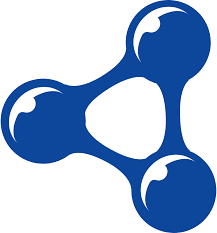
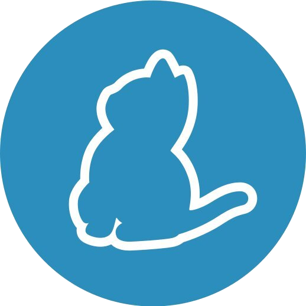
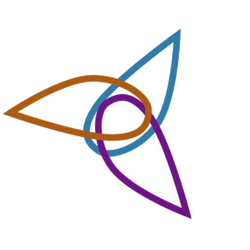
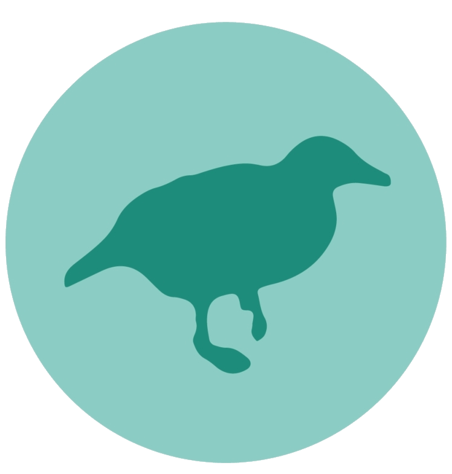
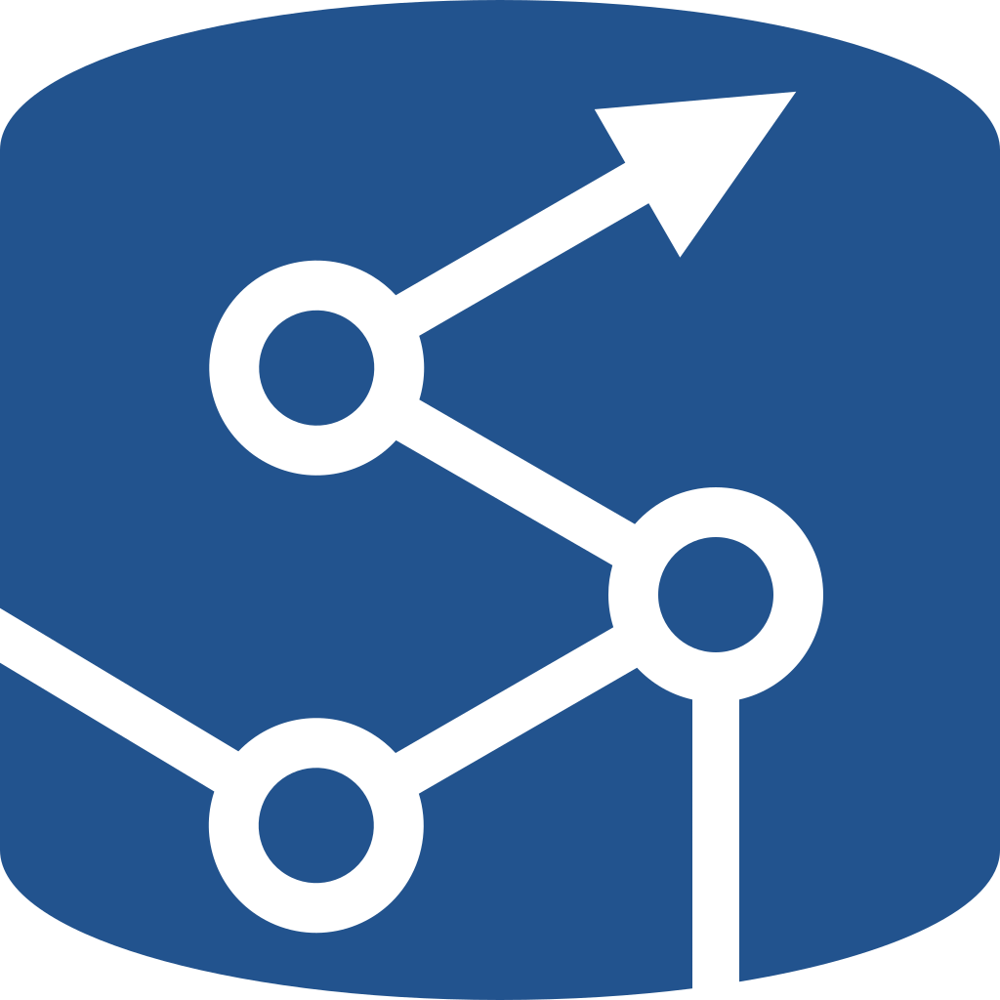
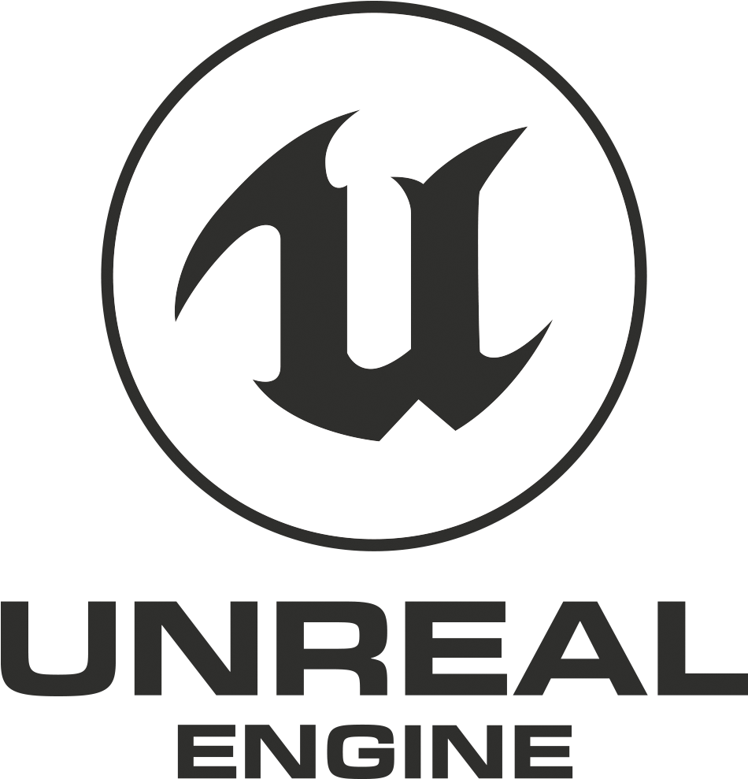

### About Me

- 👨🏻‍💻 Working towards becoming a well-rounded Developer!
- 🌱 Upon a [continuous learning adventure](https://blue-eyes-frontend-dragon.github.io/Knowledge-Resume/) 🛫
- 🧼 Passionate about code cleanliness 😅
- 👨🏻‍🔬 I Love to blend my interests into my projects
- ⚙ Looking for cool projects to join! 😎

    
<a href="https://lukemccann.github.io/Documents/">CV</a>

    
Additional Interests

- 🎸 I love playing my guitars (6, 7, & 8 Strings)
- 🌑 I have a keen interest in Physics & Quantum Mechanics
- 🏋🏻‍♂️ I enjoy Weight Lifting & Running, among other activities 💪🏻
- 📚 I am an avid reader, mostly Non-Fiction & Fantasy Novels
- 🎮 I am both a PC & Console Gamer
- 🎲 I also enjoy card and board games
- 🎥 I enjoy watching movies with friends

    
Formal Education

- 

    
2015 - 2020 | The University of Huddersfield 🎓

    - MEng Software Engineering | 1st 📜
    - Bsc Software Engineering | 1st (Hons) 📜

    
Professional Experience

- 

    
2021 - Present | DDR-Digital 👨🏻‍💻

    - Fullstack Developer 📚

- 

    
2020 - Present | Connex One 👨🏻‍💻

    - Backend Developer 🐘

- 

    
2017 - 2018 | European University Institute 🌎

    - Technical Support Officer ⚙

- 

    
2014 - 2015 | Citizens Advice Bureau 🌎

    - Technical Support Engineer ⚙
    - MINTED Frontend Developer ♨

### Listening To 🎧

    
🶠Recently Played

### Connect with me:

<!-- [][website] -->
[][linkedin]
[][steam]
<!-- [][discord] -->

 

 

### Languages & Frameworks: 

 
 

 
 

### Tools: 

 
 

  
  

 
 

### Engines:

 
 

 

### Join My Servers:
[][valheim]

 
 

 

 

<!-- 

 ⚡ Recent Activity
 -->

<!--START_SECTION:activity-->

<!--END_SECTION:activity-->

<!-- 
 -->

 

[website]: https://planetdebug.tech
[linkedin]: https://www.linkedin.com/in/lukemccann-engineering/
[steam]: https://steamcommunity.com/id/Developer-LukeMcCann/

[valheim]: https://server.nitrado.net/eng/toplist/view/8020761
